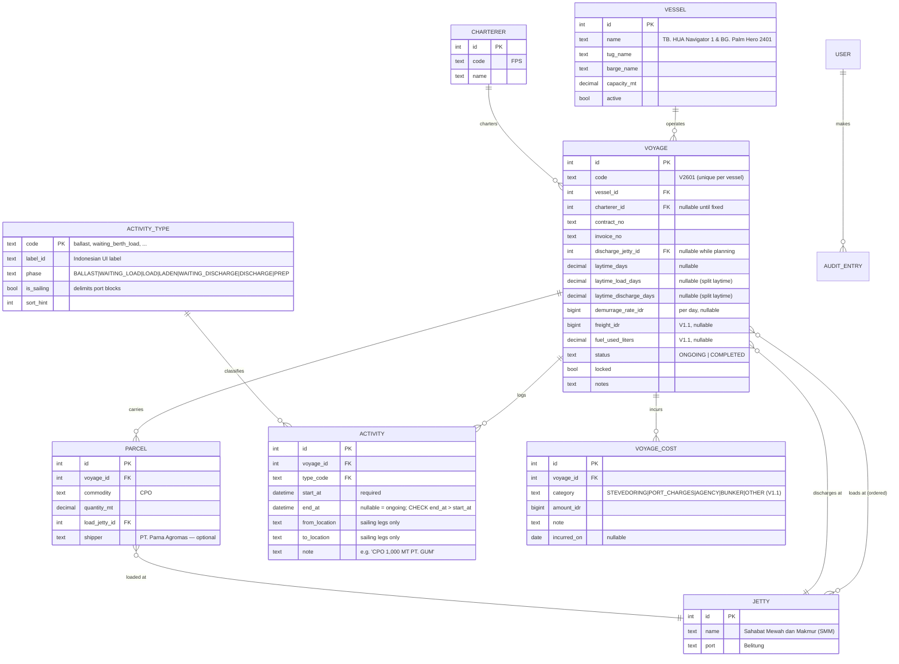

# 03 — ERD & Data Dictionary

Grounded in the 11 real voyage sheets (`docs/reference/timesheets-raw.json`).
Principle: **timestamps are stored; day counts and money outcomes are always
computed** (see `04-calculation-spec.md`).

## ERD

Not shown: Django `User` (built-in; **no role groups — one permission level for
all office admins, per ADR-009**) and audit history tables generated by
django-simple-history on VOYAGE, PARCEL, ACTIVITY, VOYAGE_COST, and master data.

`VOYAGE_COST` (V1.1) exists because the company explicitly asked to track
"stevedoring and all that stuff": one row per cost item, seeded categories
(stevedoring, port charges, agency, bunker, other) extendable in master data.
Fixed money columns stay on VOYAGE only for revenue-side (`freight_idr`) and
the operational stat `fuel_used_liters`; all voyage *costs* are line items.

## Activity types (fixed lookup, seeded)

| code | Indonesian label | phase | is_sailing |
|---|---|---|---|
| `ballast` | Perjalanan ke lokasi muat | BALLAST | ✔ |
| `waiting_berth_load` | Tunggu info sandar (muat) | WAITING_LOAD | |
| `waiting_load` | Tunggu info muat | WAITING_LOAD | |
| `loading` | Kegiatan muat | LOAD | |
| `waiting_cast_off` | Tunggu info cast off | WAITING_LOAD | |
| `shifting` | Shifting antar jetty | WAITING_LOAD | ✔* |
| `laden` | Perjalanan ke lokasi bongkar | LADEN | ✔ |
| `waiting_berth_discharge` | Tunggu info sandar (bongkar) | WAITING_DISCHARGE | |
| `waiting_discharge` | Tunggu info bongkar | WAITING_DISCHARGE | |
| `discharging` | Kegiatan bongkar | DISCHARGE | |
| `preparation` | Persiapan / lain-lain | PREP | |

\* `shifting` and short `ballast` legs between two **load** jetties both appear
in the real data as block delimiters (HN1 V2606 uses `shifting`; HN2 V2601 logs
a second "Perjalanan ke lokasi muat"). Block segmentation is defined in
`04-calculation-spec.md`, not by type alone.

## Data dictionary (field-level detail)

### VOYAGE
| Field | Type | Rules | Real example |
|---|---|---|---|
| code | char(10) | `V<yy><nn>`; **unique together with vessel** (both vessels have a V2601!) | `V2601` |
| contract_no | char(60) | free text; format `nnn/PARTIES/ROMAN-MONTH/YYYY` not enforced (real data deviates) | `001/FN-HUAT/I/2026` |
| invoice_no | char(60) | free text, nullable (V2607 has none yet) | `001/INV/HUAT-FPS/I/2026` |
| laytime_days | decimal(4,1) | nullable; if split fields present, must equal their sum | `12` |
| laytime_load/discharge_days | decimal(4,1) | nullable pair; from 2025 format "6 Hari Muat + 6 Hari Bongkar" | `6` / `6` |
| demurrage_rate_idr | bigint | per day; nullable = no demurrage clause (prints "-") | `20000000` |
| status | enum | ONGOING/COMPLETED; two real voyages are currently ONGOING (V2607, HN2-V2603) | |
| locked | bool | auto-true on COMPLETED; unlock requires confirm + audit entry | |

### PARCEL
| Field | Type | Rules | Real example |
|---|---|---|---|
| commodity | char(40) | choices seeded: CPO, RBD Palm Olein, RBD Palm Stearin, CPKO, PFAD, PKE; extendable | `CPO` |
| quantity_mt | decimal(10,3) | **always stored in MT**; KG normalized on entry/import (÷1000) | `4000` / `4130` |
| shipper | char(120) | optional; used on multi-parcel voyages | `PT. Tintin Boyok SM` |

### ACTIVITY
| Field | Type | Rules | Real example |
|---|---|---|---|
| start_at | timestamptz | required; stored UTC, **displayed Asia/Jakarta (WIB)** — every port in the data is UTC+7; revisit if they ever serve WITA ports | `2026-01-04 23:30` |
| end_at | timestamptz | nullable (ongoing); DB `CHECK (end_at > start_at)` | `2026-01-09 14:30` |
| from/to_location | char(120) | sailing legs only; free text in V1 (real data mixes jetty names and non-jetty points like "PT. Bintang Inti Persada, Batam") | `Jetty PT. SMM, Belitung` |

### Integrity constraints (database level)
1. `CHECK (end_at > start_at)` on ACTIVITY
2. `UNIQUE (vessel_id, code)` on VOYAGE
3. FKs `PROTECT` (can't delete a jetty/vessel/charterer in use)
4. `CHECK (laytime_load_days + laytime_discharge_days = laytime_days)` when all three set
5. Money columns bigint (integer rupiah) — no floats anywhere
6. Application-level (warnings, not blocks): overlap between activities of one
   voyage; gap > 30 min between consecutive activities; port days > laytime

## Modeling decisions & why

- **Load jetties**: derived M2M through PARCEL (`parcel.load_jetty`) plus an
  ordered explicit list on the voyage for display order. If this proves
  redundant during implementation, keep only parcels (ADR to be updated).
- **Locations on activities as free text** in V1, not FK to JETTY: real sailing
  legs start/end at non-jetty locations (shipyards, anchorages, "PT. Bintang
  Inti Persada, Batam"). A later cleanup can promote frequent values to
  master-data locations.
- **No stored day counts anywhere.** The Excel stores them and the Excel has
  errors; that's the point of this system.
- **Split vs combined laytime both supported** because both occur in real
  contracts (2025 vs 2026 sheets).
